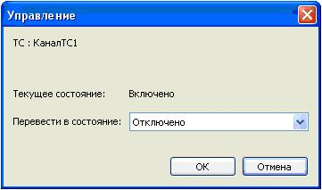
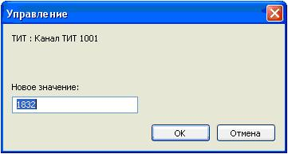
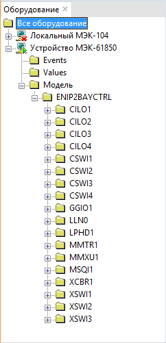
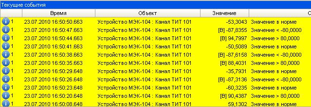

# Клиент
{:.no_toc}

* TOC
{:toc}

## Главное окно

Главное окно графического клиента имеет строку меню, расположенную под заголовком окна, панель команд, находящуюся под нею, и строку состояния, примыкающую к нижней границе окна.

Строка меню содержит следующие пункты:

<dl>

<dt>Схема</dt>
<dd>Содержит список всех доступных мнемосхем. Служит для вызова мнемосхем.</dd>

<dt>График</dt>
<dd>Позволяет создать новое окно графика или вызвать существующий график, внесенный ранее в избранное.</dd>

<dt>Таблица</dt>
<dd>Позволяет создать новое окно таблицы или пользовательской таблицы.</dd>

<dt>Объект</dt>
<dd>Содержит контекстный список команд, применимых к выделенному объекту.</dd>

<dt>Далее</dt>
<dd>Позволяет отображать различные панели и окна редактирования конфигурации в режиме администрирования. Также содержит команды импорта и экспорта конфигурации.</dd>

<dt>Лист</dt>
<dd>Команды для работы с листами. Позволяет создать, переименовать или удалить лист. Также содержит список всех листов для переключения между ними.</dd>

<dt>Окно</dt>
<dd>Команды для работы с окнами текущего листа. Позволяет переименовывать и закрывать открытые окна, а также помещать окна в избранное (см. [Избранное]). Содержит список окон и позволяет переключаться между ними. Кроме того, содержит список последних закрытых окон, позволяя восстановить случайно закрытое окно.</dd>

<dt>Настройки</dt>
<dd>Позволяет изменять внешний вид и поведение графического клиента.
  <dl>

  <dt>Панель инструментов</dt>
  <dd>Позволяет изменить расположение панели инструментов, либо скрыть ее.</dd>

  <dt>Строка состояния</dt>
  <dd>Позволяет скрыть или отобразить строку состояния.</dd>

  <dt>Подтверждение управления</dt>
  <dd>При включении этой опции, позволяет избежать случайной выдачи команд управление. При выполнении команды управления пользователем будет выдан запрос для подтверждения команды, либо отказа от ее выполнения.</dd>

  <dt>Сообщение об успешном управлении</dt>
  <dd>При успешном выполнении команды, добавляет соответствующее сообщение в панель событий (данное сообщение не является системным событием).</dd>

  <dt>Показывать события при появлении</dt>
  <dd>Отображает панель событий при возникновении системного события.</dd>

  <dt>Скрывать события при квитировании</dt>
  <dd>Скрывает панель событий при квитировании всех событий.</dd>

  <dt>Мигание основного окна по событию</dt>
  <dd>При наличии неквитированных событий включает мигание заголовка главного окна.</dd>

  <dt>Звуковая сигнализация по событию</dt>
  <dd>При наличии неквитированных событий включает звуковую сигнализацию.</dd>

  <dt>Встроенный визуализатор схем MODUS</dt>
  <dd>Включает встроенную систему отображения мнемосхем MODUS. Позволяет просматривать мнемосхемы без использования ActiveXeme (см. [Встроенный визуализатор схем MODUS]).</dd>

  </dl>
</dd>

<dt>Cправка</dt>
<dd>Позволяет открыть [окно документации](http://www.telecontrol.ru/workplace_manual) или отобразить информацию о версии программы.</dd>

</dl>

У нижней границы окна располагается строка состояния. В строке состояния отображается следующая информация:
* количество неквитированных событий;
* текущий порог важности фильтра событий;
* имя пользователя, пользующегося клиентом в данный момент;
* состояние связи с сервером.

Центральная часть главного называется листом. На листе могут быть открыты панели и рабочие окна. Допускается создание нескольких листов, при этом всегда отображается один из них. Листы можно переключать, выбирая соответствующее имя в меню "Лист". Имя листа можно изменить с помощью команды меню "Лист - Переименовать".

Открытые окна имеют заголовки, в котором отображается имя окна. Справа от имени располагается кнопка закрытия окна. Имя окна может быть изменено командой меню «Окно - Переименовать». При щелчке правой кнопкой по заголовку отображается контекстное меню окна, позволяющее переименовать окно, закрыть его или добавить в избранное (см. [Избранное]).

Окна и панели могут располагаться на листе в произвольной разметке. Для перемещения окна по разметке следует перетащить его мышью за заголовок. При перетаскивании синим цветом будет показано новое расположение окна. Окна могут располагаться как рядом, с использованием горизонтального или вертикального разбиения, так и в «стопке» - в этом случае окна накладываются одно на другое, щелчок по заголовку позволяет переместить нужное окно на верх. При сохранении листа разметка окон сохраняется, что позволяет переключать наборы отображаемых данных в зависимости от необходимости.

При закрытии окна, оно помещается в корзину. Корзина содержит 10 последних закрытых окон. Для восстановления окна из корзины нужно выбрать его имя в нижней части меню «Окно».

Любое окно может быть помещено в избранное. Для этого нужно выбрать команду меню Окно — В избранное, после чего ввести имя окна для идентификации. При этом окно сохраняется вместе с содержимым и может быть вызвано в любой момент из панели избранного (см. [Панель избранного]). Кроме того, графики и таблицы, помещенные в избранное начинает отображаться в соответствующем пункте меню главного окна.

## Панель команд

Панель команд, располагающаяся под строкой меню, служит для быстрого доступа к командам выделенного объекта.

### Команды объектов

<dl>

<dt>График</dt>
<dd>Отображает окно графика по выделенному объекту. Если график с объектом уже открыт, переключается на нее.</dd>

<dt>Таблица</dt>
<dd>Отображает таблицу по выделенному объекту или группе объектов. Если таблица с объектом уже открыта, переключается на нее.</dd>

<dt>Схема</dt>
<dd>Отображает мнемосхему, содержащую привязку к выделенному объекту. Если мнемосхема уже открыта, переключается на нее. Также выделяет привязанного графический элемент на схеме и индицирует его положение анимацией.</dd>

<dt>Данные</dt>
<dd>Отображает таблицу истории изменения значения выделенного объекта. Если таблица истории уже открыта для этого объекта, переключается на нее.</dd>

<dt>Сводка</dt>
<dd>Отображает сводку данных выделенного объекта. Если сводка уже открыта для этого объекта, переключается на нее.</dd>

<dt>События</dt>
<dd>Отображает журнал системных событий, относящихся к выделенному объекту. Если журнал событий уже открыт для этого объекта, переключается на него.</dd>

<dt>Таблица группы</dt>
<dd>Отображает таблицу для всех объектов, находящихся в той же группе, что и выделенный объект.</dd>

<dt>Квитировать</dt>
<dd>Квитирует все события, относящиеся к выделенному объекту.</dd>

<dt>Снять блокировку</dt>
<dd>Снимает блокировку с выделенного объекты (см. [Блокировка]).</dd>

<dt>Управление</dt>
<dd>Позволяет выдать команду ТУ или телерегулирования для выделенного объекта (см. [Управление]).</dd>

<dt>Ручной ввод</dt>
<dd>Позволяет ввести нового значение объекта вручную (см. [Ручной ввод]).</dd>

<dt>Устройство</dt>
<dd>Группа команд, применимых к устройству, связанного с выделенным объектом. Идентично аналогичной группе команд устройства.</dd>

</dl>

### Команды устройств

<dl>

<dt>Наблюдение</dt>
<dd>Отображает окно наблюдения за выделенным устройством.</dd>

<dt>Метрики</dt>
<dd>Отображает таблицу метрик выделенного устройства. Если выделено направление, то отображаются также метрики по всем устройствам подключенным к направлению.</dd>

<dt>Включить</dt>
<dd>Запускает обмен сервера с выделенным устройством.</dd>

<dt>Отключить</dt>
<dd>Останавливает обмен сервера с выделенным устройством.</dd>

<dt>Устройство</dt>
<dd>Группа команд, применимых к выделенным устройству.</dd>

<dt>Опросить устройство</dt>
<dd>Заставляет сервер выполнить принудительный полный опрос устройства.</dd>

<dt>Синхронизация часов</dt>
<dd>Заставляет сервер выполнить синхронизацию часов устройства.</dd>

</dl>

### Общие команды

<dl>

<dt>Печать</dt>
<dd>Распечатывает содержимое активного окна.</dd>

<dt>Квитировать все</dt>
<dd>Квитирует все системные события.</dd>

<dt>Панель событий</dt>
<dd>Отображает панель событий. Либо переключается на панель событий, если она уже отображена.</dd>

</dl>

### Управление

Телеуправление:

Телерегулирование:

Подтверждение управления:

### Ручной ввод

Блокировка.

### Уставки

Задание уставок:

## Панель объектов

Панель объектов служит для быстрого выбора объектов, вызова различных окон и выполнения команд и операций с объектами. В панели объектов отображается структура объектов, разбитых по группам. Панель объектов можно отобразить командой меню *Далее - Объекты*.

Напротив имен объектов в правой части панели выводятся их значения и признаки качества. Недостоверные значения отображаются серым цветом. При наличии неквитированных системных событий, связанных с объектом, значение мигает желтым цветом.

Слева от объектов и групп располагается переключатель, предназначенный для включения объектов в текущее окно или или исключения их оттуда. При щелчке по переключателю группы, в текущее окно включаются все объекты нижележащей иерархии группы (переключатель самой группы при этом остается отключенным, т.к. группы не могут быть включены в окна).

При двойном щелчке по объекту будет открыт график объекта, а при двойном щелчке по группе - таблица со всеми объектами, входящими в группу.

При щелчке правой клавишей мыши отображается контекстное меню, содержащее операции применяемые к выделенному объекту или группе.

В режиме администрирования разрешается перетаскивание объектов по иерархии мышкой.

## Панель оборудования

Для вызова панели Оборудование следует выбрать меню *Далее – Оборудование*.

### Статусы устройств

### Наблюдение

Начать наблюдение за обменом с устройством можно выбрав из контекстного меню подсистемы пункт *Наблюдение*. Смотрите описание [окна наблюдения](#device-watch).

### Устройства МЭК-61850

Панель оборудования позволяет просматривать модель данных устройств МЭК-61850. Когда связь с устройством установлена, модель данных отображается поддеревом узла устройства - Модель.

Смотрите [отображение модели МЭК-61850](architecture#iec-61850) и [проектирование](development#iec-61850) в Клиенте.

## Панель событий

Панель событий отображает список неквитированных системных событий:

Для квитирования события нужно дважды щелкнуть по строке события или выделить событие щелком по нему и затем нажать *Квитировать* на панели команд. После квитирования, событие пропадает из панели событий. Также, удерживая клавишу *Shift*, можно выделить несколько событий и квитировать их одновременно. Для квитирования всех событий нажать кнопку *Квитировать все* на панели инструментов.

При включении опции *Отображение событий при появлении* в меню *Настройки* окно будет автоматически отображено при появлении нового события.

При щелчке правой кнопкой по строке события отображается контекстное меню с командами, применяемыми к событию. Если событие связано с объектом или устройством, то также отображаются команды, применяемые к объекту или устройству.

[Команды контекстного меню] 

## Таблица

Смотрите [Таблица](client/table).

## Мнемосхема

Смотрите [Мнемосхема](client/display).

## График

Смотрите [график](client/graph).

## Данные

Таблица истории значений объекта.

## Сводка

Добавить и удалить столбцы можно из панели объектов установкой переключателя напротив объекта. Смотрите [Панель объектов](#object-tree).

Размеры таблицы ограничены 10000 строками и 1000 колонками.

При вызове Графика или Данных из окна Сводки будет использован выделенный объект и временной период.

## Пользовательская таблица

## Журнал событий

## Избранное

Добавление в избранное.

## Портфолио

Добавление в портфолио.

## Наблюдение
